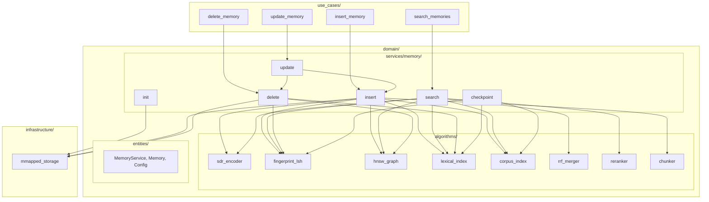
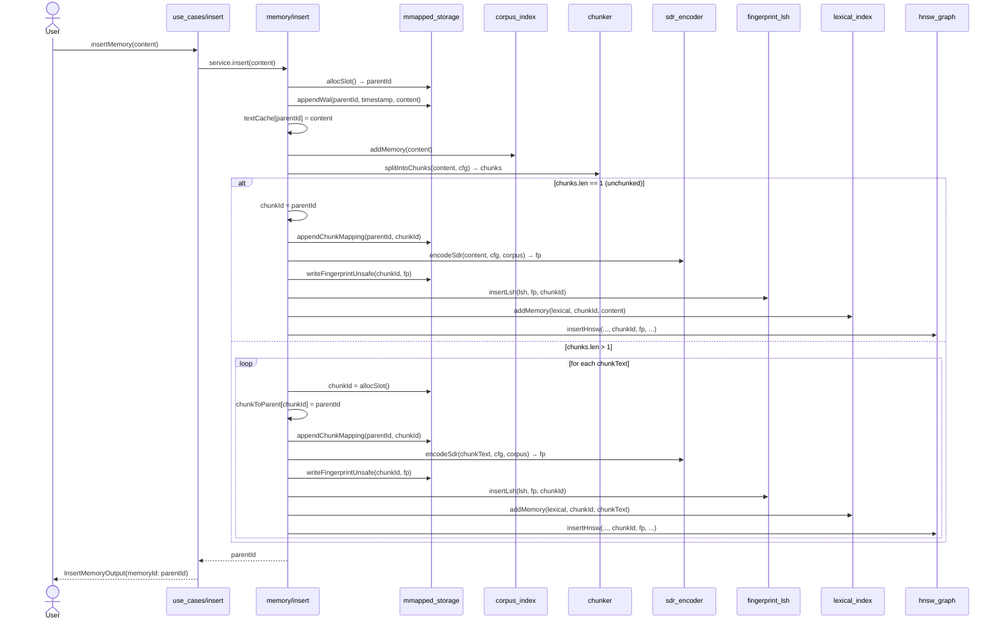
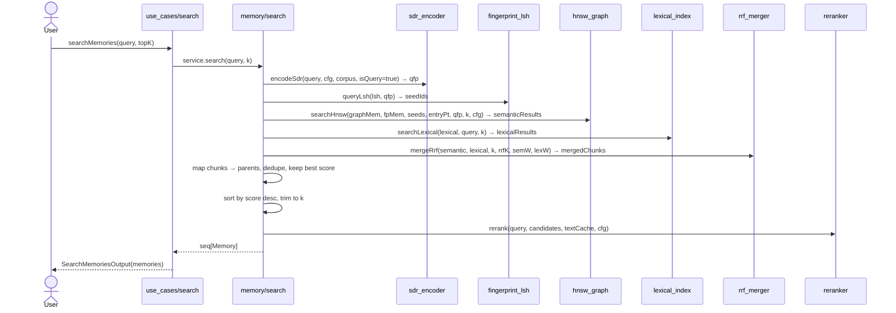
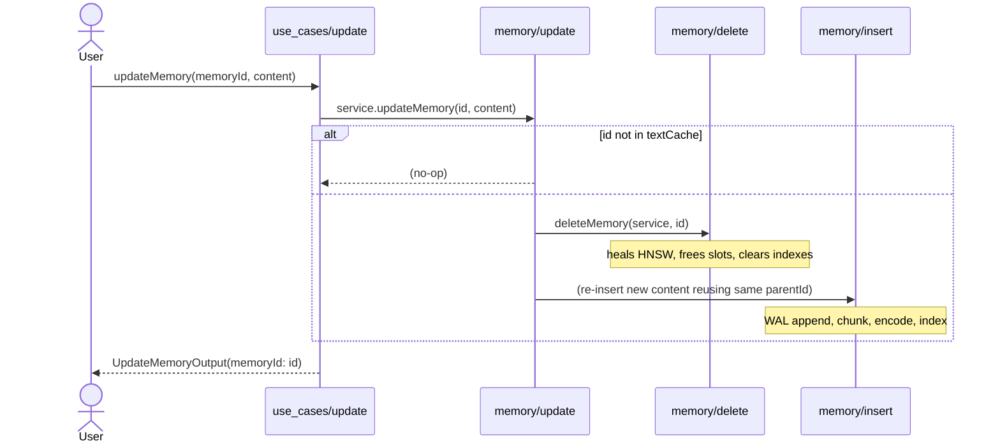
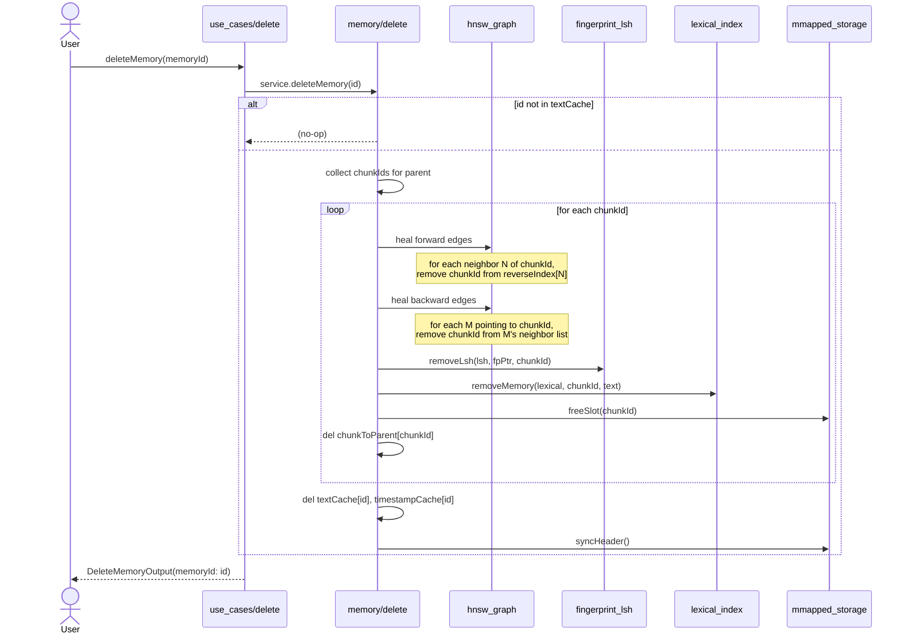
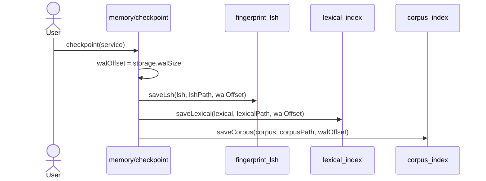

# Adaline — Operation Flows

This doc walks through the exact data flow for each use-case so agents don't have to reverse-engineer it from the code.

---

## Dependency Overview

---

## 1. Insert

### Step-by-step

1. **Allocate parent slot** `storage.allocSlot()` → `parentId` (dense uint64 slot).
2. **WAL append** — write `(parentId, timestamp, content)` to `wal.bin` for durability.
3. **Cache** — store `textCache[parentId]` and `timestampCache[parentId]`.
4. **Corpus** — `corpus.addMemory(content)` updates document-frequency table and IDF scores.
5. **Chunk** — `splitIntoChunks(content, cfg)` checks block saturation; if any block exceeds `chunkSaturationThreshold`, splits on sentence boundaries with overlap.
6. **For each chunk**:
   - Allocate chunk slot (or reuse parent slot if unchunked).
   - Write chunk→parent mapping to `chunks.bin`.
   - `encodeSdr(text, cfg, corpus)` produces a 10240-bit fingerprint (Tokens / Bigrams / XOR Context blocks).
   - Write fingerprint to `fingerprints.bin` at slot offset.
   - `insertLsh(lsh, fp, chunkId)` hashes fingerprint bands into LSH buckets.
   - `addMemory(lexical, chunkId, text)` tokenizes and builds postings list.
   - `insertHnsw(...)` greedily searches each layer, adds bidirectional edges, updates entry point if needed, and writes to `graph.bin`.
7. Return `parentId`.

---

## 2. Search

### Step-by-step

1. **Query fingerprint** — `encodeSdr(query, cfg, corpus, isQuery=true)` with denser probes (`queryProbeMultiplier`).
2. **LSH seeds** — `queryLsh(lsh, qfp)` band-hashes the query fingerprint and returns all IDs colliding in any bucket.
3. **Semantic lane** — `searchHnsw(graphMem, fpMem, seeds, entryPoint, qfp, k, cfg)`:
   - Uses seeds + entry point as starting nodes.
   - Greedy best-first search per layer, computing weighted Jaccard against `qfp`.
   - Returns top-k chunk IDs with similarity scores.
4. **Lexical lane** — `searchLexical(lexical, query, k)` scores chunks via Query Likelihood Model with Dirichlet smoothing.
5. **RRF merge** — `mergeRrf(semantic, lexical, k, rrfK, semWeight, lexWeight)` combines both lanes using Reciprocal Rank Fusion. Memories present in both lanes get boosted.
6. **Chunk→parent mapping** — for each merged chunk, look up `chunkToParent.getOrDefault(chunkId, chunkId)`. Deduplicate by parent, keeping the highest score.
7. **Build candidates** — construct `Memory` objects from `textCache`, `timestampCache`, and the deduplicated scores.
8. **Sort & trim** — sort descending by score, keep top `k`.
9. **Rerank** — `rerank(query, candidates, textCache, cfg)` applies a term-coverage boost. Exact query matches get pushed to the top.
10. Return candidates.

---

## 3. Update

### Step-by-step

1. **Guard** — if `parentId` not in `textCache`, return immediately (idempotent no-op).
2. **Delete old** — call `deleteMemory(service, parentId)` which heals the HNSW graph, removes from LSH/lexical, frees slots, and clears caches.
3. **Insert new** — reuse the same `parentId`:
   - WAL append `(parentId, newTimestamp, newContent)`.
   - Update `textCache` and `timestampCache`.
   - `corpus.addMemory(newContent)`.
   - Chunk, encode, index exactly like **Insert**.
4. The parent ID is preserved; only the underlying chunks change.

---

## 4. Delete

### Step-by-step

1. **Guard** — if `parentId` not in `textCache`, return immediately.
2. **Collect chunks** — iterate `chunkToParent` to find all `chunkId`s where `chunkToParent[chunkId] == parentId`. If none, treat the parent itself as the sole chunk.
3. **For each chunk**:
   - **Forward edge healing** — for each layer, iterate the chunk's neighbors. For each neighbor `N`, remove `chunkId` from `hnswReverseIndex[N]`.
   - **Backward edge healing** — look up `hnswReverseIndex[chunkId]`. For each node `M` that pointed to the chunk, call `removeNeighbor(mnode, layer, chunkId)` on every layer. Then delete `hnswReverseIndex[chunkId]`.
   - **Remove from LSH** — get fingerprint pointer, call `removeLsh(lsh, fpPtr, chunkId)`.
   - **Remove from lexical** — call `removeMemory(lexical, chunkId, chunkText)`.
   - **Free slot** — `storage.freeSlot(chunkId)` pushes the slot onto the freelist and zeroes the graph node.
   - **Delete mapping** — `chunkToParent.del(chunkId)`.
4. **Clean parent caches** — `textCache.del(parentId)`, `timestampCache.del(parentId)`.
5. **Sync header** — persist updated freelist and record count to `fingerprints.bin` header.

---

## 5. Checkpoint

### Step-by-step

1. Capture current `walSize` as the offset.
2. Serialize in-memory LSH buckets to `lsh.bin`.
3. Serialize lexical postings to `lexical.bin`.
4. Serialize corpus frequencies to `corpus.bin`.
5. On next startup, `initMemoryService` loads these three indexes and only replays WAL entries written **after** `walOffset`.
