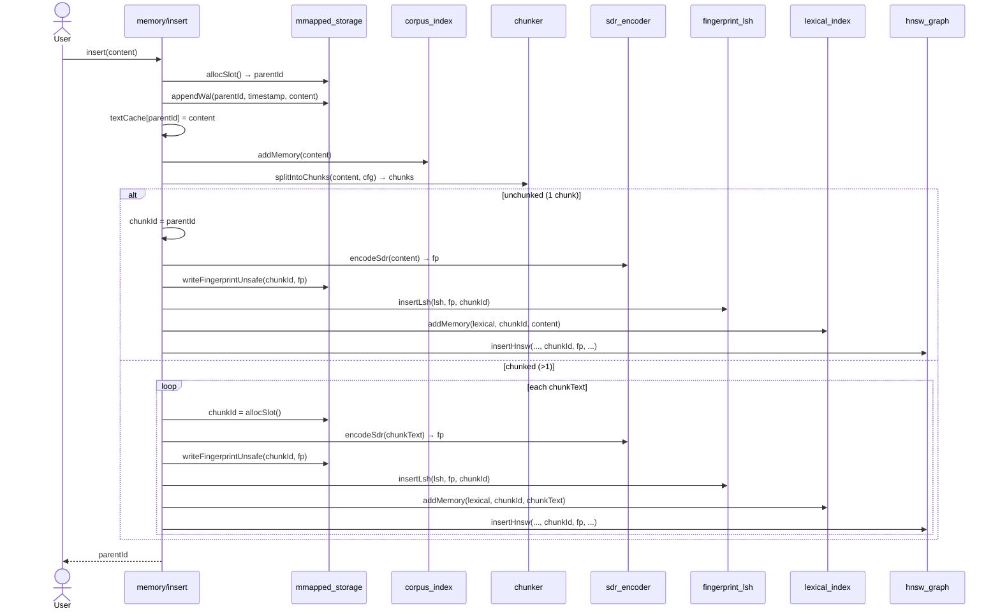
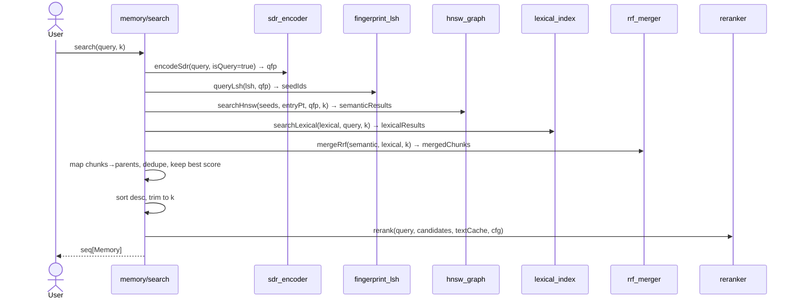
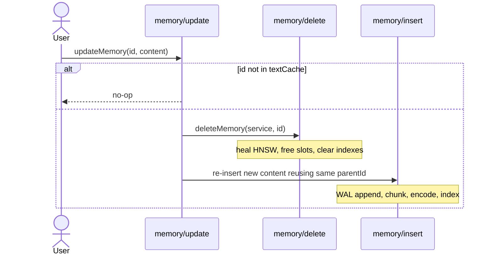
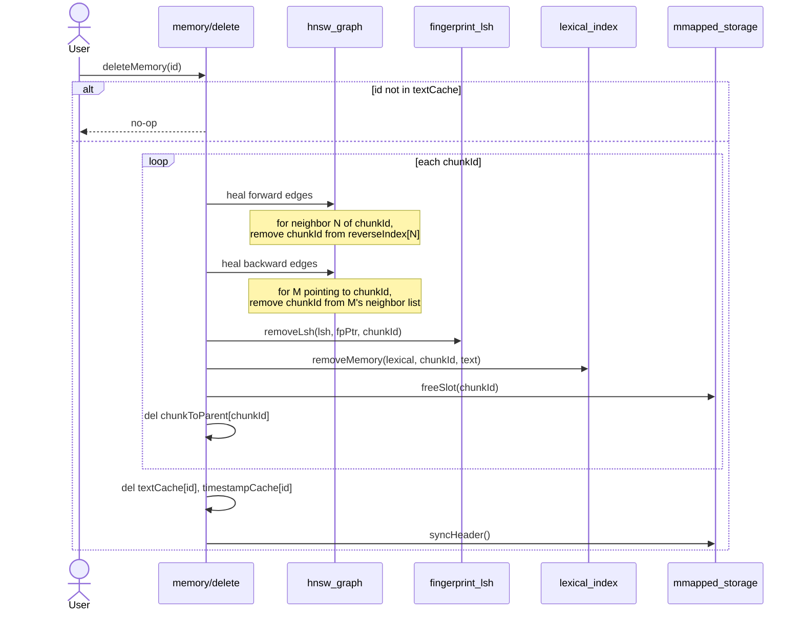

# Adaline

A Nim vector search engine that turns text into **10240-bit sparse fingerprints** and searches them with HNSW + LSH, plus a lexical index for token-based matching. Results are fused with Reciprocal Rank Fusion and reranked by term coverage.

- **Conditional chunking** — long text splits into sentence-aware chunks when fingerprints approach saturation
- **Delete & update** — `deleteMemory()` physically heals HNSW edges via a reverse edge index, removes from all indexes, and returns slots to a freelist. `updateMemory()` preserves the parent ID while replacing content.
- **Checkpoint / fast restart** — `checkpoint()` persists indexes to disk; restarts only replay WAL after the checkpoint
- **Single binary, no dependencies** — memory-mapped files, no external services

---

## How it works

### Insert



1. Allocate a dense slot (`parentId`).
2. Append `(parentId, timestamp, content)` to `wal.bin`.
3. Update `textCache` and `corpus` document-frequency table.
4. Chunk if any fingerprint block exceeds saturation.
5. For each chunk: encode SDR → write fingerprint → insert into LSH → add to lexical index → insert into HNSW graph.

### Search



1. Encode query into a dense-query fingerprint.
2. LSH band-hash query to get seed candidates.
3. HNSW greedy search from seeds/entry point → semantic scores.
4. Lexical inverted-index search with QLM + Dirichlet smoothing.
5. RRF merge of both lanes.
6. Chunk→parent mapping + deduplication.
7. Sort, trim to `k`, rerank by term coverage.

### Update



1. Guard: no-op if `id` is unknown.
2. Delete old chunks (heals graph, frees slots).
3. Insert new content with the **same** `parentId`.

### Delete



1. Guard: no-op if `id` is unknown.
2. Collect all chunk IDs for the parent.
3. For each chunk:
   - Heal HNSW forward edges (remove from neighbors' reverse index).
   - Heal HNSW backward edges (remove from predecessors' neighbor lists).
   - Remove from LSH and lexical index.
   - Free slot to freelist.
4. Remove parent from caches and sync header.

### Checkpoint

1. Capture current `walSize`.
2. Serialize LSH buckets → `lsh.bin`.
3. Serialize lexical postings → `lexical.bin`.
4. Serialize corpus stats → `corpus.bin`.
5. On restart, replay only WAL entries after the checkpoint offset.

**Storage:** Flat memory-mapped files with 256-byte headers (`ADLN` magic). Slots are dense indices (0, 1, 2…) rather than byte offsets. Pre-allocated 64 MiB chunks minimize remap frequency.

| File | Purpose |
|------|---------|
| `wal.bin` | Append-only text + metadata |
| `fingerprints.bin` | Fingerprint store (header + 1280-byte slots) |
| `graph.bin` | HNSW node store (header + 2056-byte slots) |
| `chunks.bin` | Parent→chunk mappings |
| `lsh.bin` | Persisted LSH index (checkpoint) |
| `lexical.bin` | Persisted lexical postings (checkpoint) |
| `corpus.bin` | Persisted corpus stats (checkpoint) |

---

## Quick start

```bash
# Build
nimble build_release

# Insert
./adaline insert "The quick brown fox"
./adaline insert "Nim is a systems programming language"

# Update / Delete
./adaline update 0 "Updated text"
./adaline delete 1

# Search
./adaline search "quick fox" 5

# Stats
./adaline stats

# Tests
nimble test

# Benchmarks
nimble benchmark
./benchmarks/benchmark_beir scifact
./benchmarks/benchmark_beir nfcorpus
./benchmarks/benchmark_longmemeval
./benchmarks/benchmark_crud scifact 1000 1000
```

---

## Benchmarks

Apple MacBook Air M2 (16 GB). Full tables and methodology in [`BENCHMARK.md`](BENCHMARK.md).

| Dataset | Corpus | Indexing | Query (top-100) | nDCG@10 | R@5 |
|---------|--------|----------|-----------------|---------|-----|
| SciFact | 5,183 docs | 2,350 docs/s | 223 q/s | 0.557 | — |
| NFCorpus | 3,633 docs | 2,175 docs/s | 361 q/s | 0.277 | — |
| LongMemEval-S | 500 questions | — | — | — | 94.6% |

SciFact: Recall@1 = 43.3%, MRR = 0.54. P50 latency ~4.4 ms for top-100.
NFCorpus: Precision@1 = 38.7%, MRR = 0.47. Hard medical retrieval task with sparse labels.
LongMemEval-S: R@1 = 78.2%, R@5 = 94.6%. Conversational memory retrieval.

---

## Configuration

`domain/entities/config.nim`:

| Parameter | Default | Description |
|-----------|---------|-------------|
| `fingerprintBytes` | 1280 | Fingerprint size (10240 bits) |
| `tokenWeight` | 0.50 | Jaccard weight for token block |
| `bigramWeight` | 0.25 | Jaccard weight for char-bigram block |
| `contextWeight` | 0.25 | Jaccard weight for XOR-context block |
| `lshBands` / `lshRows` | 50 / 2 | Fingerprint LSH banding |
| `hnswMaxLayers` | 8 | HNSW layer count |
| `hnswMaxNeighbors` | 32 | Max edges per layer |
| `hnswEfConstruction` | 200 | HNSW build beam width |
| `hnswEfSearch` | 64 | HNSW query beam width |
| `dirichletMu` | 2000.0 | QLM smoothing parameter |
| `rrfK` | 60 | RRF constant |
| `rerankCoverageWeight` | 0.5 | Term-coverage boost weight |
| `chunkSaturationThreshold` | 0.6 | Chunk when any block exceeds this saturation |

---

## Design

Dependency flow: `Use Cases ← Domain ← Infrastructure`. Domain services call into `infrastructure/` directly. Not Clean Architecture — simplicity and performance over strict layers.

**Delete / Update:** `deleteMemory()` removes from LSH, lexical, and HNSW. An in-memory reverse edge index heals HNSW neighbor lists so no orphaned edges remain. The slot goes to a freelist for reuse. `updateMemory()` deletes old chunks and inserts new ones, preserving the parent ID. Both are WAL-logged; restarts replay the log and rebuild all in-memory indexes. `checkpoint()` persists indexes to skip WAL replay on startup.

**Chunking:** Long documents are split into sentence-aware chunks with one-sentence overlap. Each chunk gets its own fingerprint. Prevents saturation and keeps fingerprints sparse. Short documents stay single-chunk.
